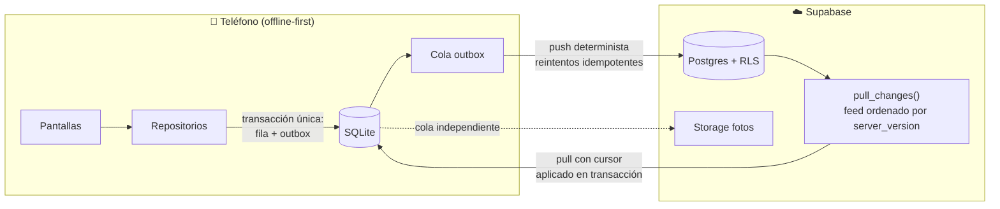

# 🐄 AgroVida

**App móvil offline-first para la administración de fincas lecheras.** Registra producción de leche, hato, genealogía, salud y reproducción — con o sin señal — y sincroniza automáticamente entre todos los dispositivos de la finca cuando vuelve la conexión.

> Construida para el campo colombiano: fincas donde la señal es intermitente, varios trabajadores registran a la vez y los datos no pueden perderse jamás.

## ✨ Funcionalidades

| | |
|---|---|
| 🥛 **Producción de leche** | Registro por jornada (mañana/tarde), total del día, comparación con ayer y tendencia de 7 días por vaca y por finca |
| 🐮 **Hato completo** | Fichas con foto, chapeta, raza, edad derivada, estados independientes (lactancia / preñez / ciclo de vida) y genealogía navegable madre ↔ hijas |
| 💉 **Salud** | Tratamientos, vacunas y enfermedades con **retiro de leche por medicamento** y advertencia visible hasta que expira |
| 🤰 **Reproducción** | Celos, inseminaciones, chequeos de preñez y partos, con **fecha estimada de parto** calculada (283 días de gestación) |
| 🔔 **Recordatorios** | Derivados de los datos: secado recomendado, parto próximo, chequeo de preñez pendiente y retiros activos |
| 📊 **Exportar a Excel/CSV** | Inventario, producción, salud y reproducción listos para compartir por WhatsApp, Drive o correo |
| 👥 **Multi-finca y multi-usuario** | Roles de propietario y trabajador, invitaciones por correo, aislamiento total entre fincas |
| ✈️ **100% offline** | Todo funciona en modo avión; la sincronización es automática, reintentable y sin botones de "subir" |

## 🏗 Cómo funciona la sincronización

El problema central de una app de campo: **dos personas editando los mismos datos sin internet**. AgroVida lo resuelve con un patrón *outbox* transaccional sobre SQLite y un cursor monotónico del servidor — nunca relojes de dispositivo:



- **Escrituras**: cada cambio guarda la fila de dominio **y** su entrada de outbox en una sola transacción SQLite — o queda todo, o no queda nada.
- **Push**: en orden determinista, con reintentos idempotentes y backoff acotado; un rechazo permanente nunca se descarta en silencio (va a una bandeja de conflictos con resolución explícita).
- **Pull**: un feed unificado ordenado por `server_version` global; el cursor solo avanza cuando el lote quedó aplicado localmente.
- **Seguridad**: Row Level Security por finca en cada tabla, verificada con 43 aserciones pgTAP (aislamiento entre fincas, permisos de trabajador, unicidad).
- **Fotos**: cola de subida independiente — una foto fallida jamás bloquea los datos.

## 🛠 Stack

React Native · Expo SDK 56 · TypeScript estricto · Expo Router · SQLite (expo-sqlite) · Supabase (Postgres, Auth, Storage, RLS) · Reanimated · Jest (93 tests) · pgTAP (43 aserciones)

**Decisiones de ingeniería destacadas** (bitácora completa en [`docs/DECISIONS.md`](docs/DECISIONS.md)):
- Los valores derivados (edad, totales, tendencias, fecha de parto) **nunca se almacenan** — se calculan al leer.
- El acceso a SQLite pasa por una interfaz de driver: la app usa `expo-sqlite` y los tests corren contra `better-sqlite3` en Node — migraciones, repositorios y el motor de sync completo se prueban sin emulador.
- Estados del animal como dimensiones independientes (una vaca puede estar lactando **y** preñada).
- Copy 100% es-CO centralizado para internacionalizar sin refactorizar.

Hoja de ruta de funcionalidades: [`docs/ROADMAP.md`](docs/ROADMAP.md)

---

# 🧑‍💻 Desarrollo

Estado del proyecto y bitácora por fases: [`docs/IMPLEMENTATION_STATUS.md`](docs/IMPLEMENTATION_STATUS.md)

## Comandos

```sh
npm install               # dependencias
cp .env.example .env      # completar con el proyecto Supabase (URL + publishable key)
npm start                 # Metro / Expo dev server (escanear QR con Expo Go SDK 56)
npm run android           # abrir en dispositivo/emulador Android

npm run typecheck         # tsc --noEmit
npm run lint              # eslint
npm test                  # jest (dominio + integración con better-sqlite3 + componentes)
npm run doctor            # expo-doctor
npx expo export --platform android   # verificar que el bundle compila
```

Backend (requiere Docker para la pila local): ver [`supabase/README.md`](supabase/README.md)

```sh
npm run db:reset          # aplicar migraciones desde cero en local
npm run db:test           # suites pgTAP (RLS, constraints, feed)
npm run db:push           # aplicar migraciones al proyecto hosted
```

Sin `.env` la app arranca en modo local y lo indica en la pantalla de login; la sincronización queda deshabilitada hasta configurar Supabase.

## Estructura

- `src/app/` — rutas Expo Router (pantallas)
- `src/features/` — casos de uso: auth, bootstrap, rebaño, sync, recordatorios, exportación
- `src/components/` — componentes visuales reutilizables
- `src/db/` — driver SQLite, esquema y migraciones locales
- `src/repositories/` — persistencia de dominio (la UI no emite SQL)
- `src/sync/` — outbox, motor de sync, cursor, conflictos, fotos
- `src/lib/` — cliente Supabase, env, logger, tokens de diseño, i18n es-CO
- `supabase/` — migraciones versionadas, RLS y tests pgTAP
- `tests/` — unit e integración (Jest, better-sqlite3)

## Fuente de verdad documental

Leer en este orden: [`CLAUDE.md`](CLAUDE.md) → [`docs/DECISIONS.md`](docs/DECISIONS.md) → [`docs/PRODUCT_SPEC.md`](docs/PRODUCT_SPEC.md) → [`docs/ARCHITECTURE.md`](docs/ARCHITECTURE.md) → [`docs/DESIGN_SPEC.md`](docs/DESIGN_SPEC.md). `references/AgroVida.dc.html` es solo referencia visual; no es código de producción.
